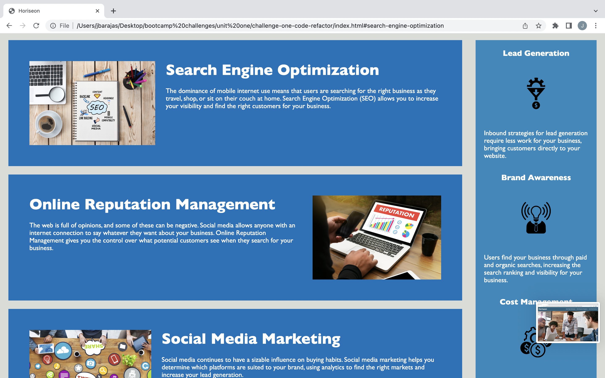

# Challenge-One-Code-Refactor

## Description

This project primarily involves a refactoring of existing code for a website. The refactoring process will make the website more accessible, which will allow it to appear higher on search engine priority. In addition to accessibility, cleaning up the code with semantic elements will make it easier for future developers to work with the code. Overall, this project assured the website's optimal functionality, and it reinforced several important concepts I've learned so far in coding, especially using semantic elements and selectors to make code easier to read and adjust.

## Installation

N/A

## Usage

Visit the webpage using this link: https://j6barajas.github.io/challenge-one-code-refactor/

## Credits

Source code and assets provided by bootcamp instructor.
